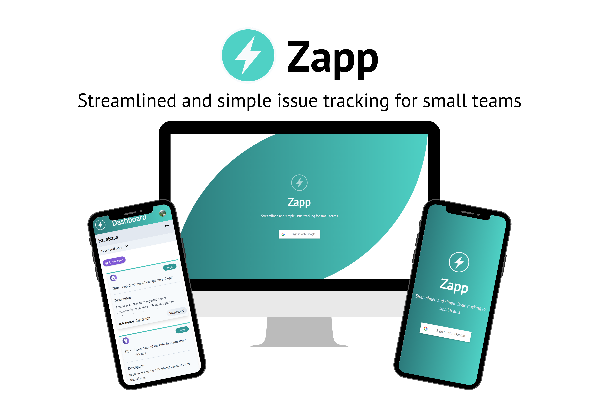

# Zapp

<!-- Remember to reflect any changes to the readme in the Table of Contents-->

## Streamlined and simple issue tracking for small teams

  

Zapp is an app for managing issues in the software development lifecycle. Zapp is designed with small teams in mind and aims to make issue tracking simple and straightforward.

## Table of Contents

- [Live Demo](#Live-Demo)

- [Features](#Features)

- [Project Presentation](#Project-Presentation)

- [Getting Started](#Getting-Started)

  - [Setup Prerequisites](#Setup-Prerequisites)

  - [Server & Database Setup](#Server-&-Database-Setup)

  - [Start the App](#Start-the-App)

- [Tech Stack](#Tech-Stack)

  - [Front End](#Front-End)

  - [Back End](#Back-End)

- [Contributors](#Contributors)

- [License](#License)

## Live Demo

You can find a deployed version of the App [here.](https://zappbugtracker.herokuapp.com/)

Client and Server are hosted on [Heroku.](https://www.heroku.com/home)
Database is hosted on [ElephantSQL.](https://www.elephantsql.com/)

## Features

Make issue tracking easy with Zapp. With a minimalist and highly focused UI we have aimed to solve issues for the user rather than creating them.

Zapp allows users to login through Google Authentication, create projects, log and filter issues, add user comments and receive email notifications when they have been invited to a project.

Easily invite collaborators to your projects, assign them to issues and clearly track their progress.

## Project Presentation

Zapp was developed as a Thesis Project for the coding boot camp [Codeworks](https://codeworks.me/) by [Hamish Chan](https://github.com/ilyadusoleil), [Rupert Bright](https://github.com/rupertbright-hub) and [Stephen Head-Rapson](https://github.com/SteHeRa).

You can watch the presentation of the project below:

## Getting Started

These instructions will help you setup a local development instance of the app.

#### clone the repo

`git clone https://github.com/ilyadusoleil/zapp.git`

#### install dependencies

`npm install`

### Setup prerequisites

For an example how to fill `/server/.env` see `/server/.env.example`

For an example how to fill `/client/.env` see `/client/.env.example`

In order to set up authentication you will need to register an app with [Google](https://developers.google.com/) and then provide your google client ID and Google Client Secret in your .env file as GOOGLE_CLIENT_ID & GOOGLE_CLIENT_SECRET respectively.

### Server & Database Setup

- Install server dependencies:
  `cd server`
  `npm install`
- Make sure you have Docker installed on your local machine.
- Create a `.env` file in the server directory (`/server/.env`) and fill it following the example `/server/.env.example`
- Create docker image: `docker-compose up -d`
- Initialise the database: `npx sequelize-cli db:migrate`

- The server is now ready to run. If you wish, you can seed the database with some test data by running the command `npx sequelize-cli db:seed:all`. You can change the seed or add your own data by navigating to `/server/db/seeders/` and filling in your own data.

- You can also use [Postman](https://www.postman.com/) to send requests to the server without using the client. Use this link inside the postman client to import a small library of requests: https://www.getpostman.com/collections/a578db24de24499a361d

- For more information on **Sequelize** migrations read the docs [here.](https://sequelize.org/master/manual/migrations.html)

### Start the App

- In the client directory run `npm start`
- In the server directory run `npm run dev`

## Tech Stack

### Front End

- [TypeScript](https://www.typescriptlang.org/)
- [React](https://reactjs.org/)
- [React Query](https://react-query.tanstack.com/)
- [Tailwind CSS](https://tailwindcss.com/)

### Back End

- [Express](https://expressjs.com/)
- [PostgreSQL](https://www.postgresql.org/)
- [Passport](http://www.passportjs.org/)

## Contributors

Hamish Chan - [Github](https://github.com/ilyadusoleil) - [LinkedIn](https://www.linkedin.com/in/hamish-chan-322378167/)
Rupert Bright - [Github](https://github.com/rupertbright-hub) - [LinkedIn](https://www.linkedin.com/in/rbrightb/)
Stephen Head-Rapson - [Github](https://github.com/SteHeRa) - [LinkedIn](https://www.linkedin.com/in/stephen-head-rapson/)

## License

This project is licensed under the MIT License.
